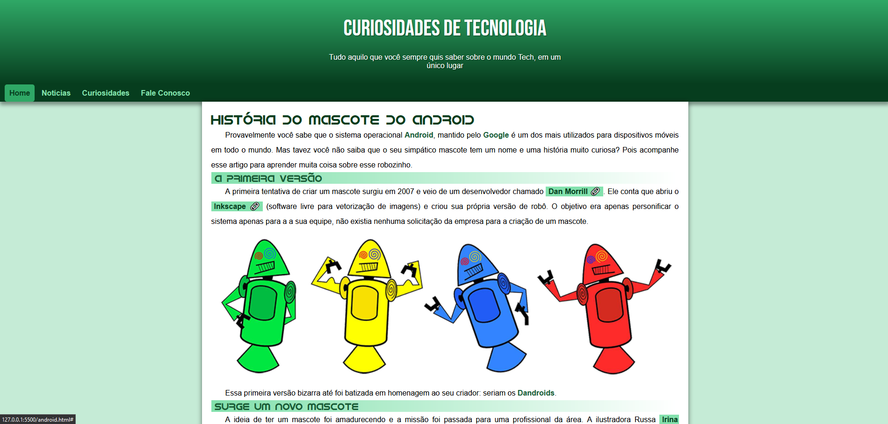

Projeto de site responsivo somente com a utilização de CSS e HTML para treinamento solicitado pelo professor Gustavo Guanabara. 

<a href="https://thiagotorresferrao.github.io/desafio_android/">Flex Grid</a>

